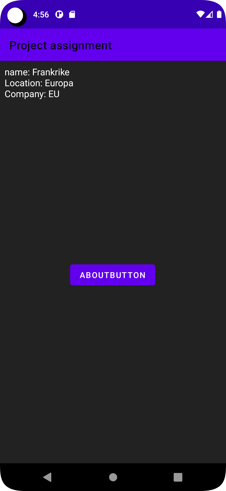
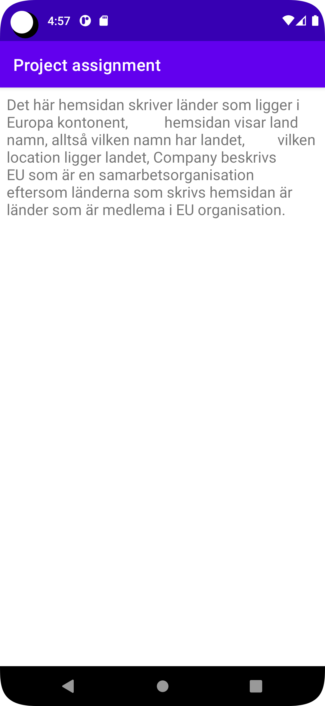
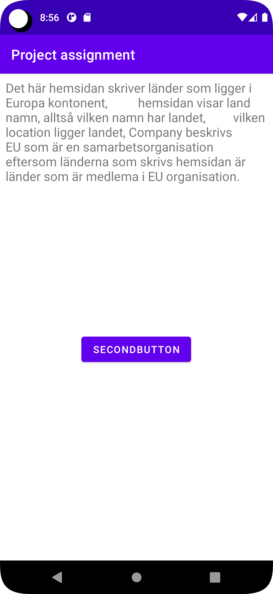

# Rapport

I MainActivity representeras som huvudaktiviteten i appen, fungerar som startpunkt.
I onCreate-metoden sattes layouten och initializerades "toolbar", RecyclerView och andra nödvändiga komponenter.
En knapp skapades och laggt in "OnClickListener" för att navigera till SecondActivity när man klickar på den.
SetAdapter-metoden har definierats för att skapa "RecyclerView" och dess "adapter".
När JSON-data hämtas i onPostExecute-metoden parsning med hjälp av Gson och "populate" RecyclerView-adaptern med data.

I SecondActivity representerar en sekundär skärm appen och visar en TextView som visar lite information om länderna i appen.
I RecyclerAdapter klass "extends" RecyclerView.Adapter och ansvarar för att förse data som ska visas i RecyclerView.
En anpassad ViewHolder-klass har definierat som innehåller ""view för varje objekt i RecyclerView.
I metoden onBindViewHolder bindas data från "Country" list till "view" i ViewHolder.
Metoden getItemCount returnerar antalet objekt i RecyclerView.
Metoden "addCountries" används för att lägga till nya länder i adapterns data och meddela RecyclerView om ändringen.

I Country klass representerar datamodellen för varje land.
Den har fält för landets ID, namn osv. Klassen har en konstruktor för att initializera dess fält och getter-metoder för att komma åt fälten.

Koden är implementeringen av en enkel app som hämtar och visar data från ett JSON-API med hjälp av RecyclerView och adaptrar.
Den visar också användningen av "intent" för att navigera mellan aktiviteter och integrationen av Gson för JSON-parsning


## Koden

```
Main Activity Java

  protected void onCreate(Bundle savedInstanceState) {
        super.onCreate(savedInstanceState);
        setContentView(R.layout.activity_main);


        //button test
        button = findViewById(R.id.sendButton);
        button.setOnClickListener(new View.OnClickListener() {
            @Override
            public void onClick(View view) {
                Intent intent = new Intent(MainActivity.this, SecondActivity.class);
                startActivity(intent);
            }
        });

        //initialize necessary components.
        Toolbar toolbar = findViewById(R.id.toolbar);
        setSupportActionBar(toolbar);
        recyclerView = findViewById(R.id.recyclerView);
        countries = new ArrayList<>();
        setAdapter();
        new JsonTask(this).execute(JSON_URL);
    }

    private void setAdapter(){
        adapter = new com.example.projectassignment.RecyclerAdapter(countries);
        RecyclerView.LayoutManager layoutManager = new LinearLayoutManager(getApplicationContext());
        recyclerView.setLayoutManager(layoutManager);
        recyclerView.setItemAnimator(new DefaultItemAnimator());
        recyclerView.setAdapter(adapter);
    }

    @Override
    public void onPostExecute(String json) {
        Log.d("MainActivity", json);
        Gson gson = new Gson();
        Type type = new TypeToken<ArrayList<Country>>() {}.getType();
        ArrayList<Country> countries = gson.fromJson(json, type);
        adapter.addCountries(countries);
    }
}
```

```
Second Activity 

public class SecondActivity extends AppCompatActivity {
    protected void onCreate(Bundle savedInstanceState) {
        super.onCreate(savedInstanceState);
        setContentView(R.layout.activity_second);

        Bundle extras = getIntent().getExtras();
        if (extras != null) {
            String name = extras.getString("");

            TextView secondTextView = findViewById(R.id.secondTextView);
           secondTextView.setText(name);

        }


    }
}
```

```
RecyclerAdapter 

class RecyclerAdapter extends RecyclerView.Adapter<RecyclerAdapter.MyViewHolder> {
    private ArrayList<Country> countries;

    public RecyclerAdapter(ArrayList<Country> countries){
        this.countries = countries;
    }
    public class MyViewHolder extends RecyclerView.ViewHolder{

        public TextView countryText;
        public TextView countryName;

        public MyViewHolder(final View view) {
            super(view);

            countryText = view.findViewById(R.id.countryText);
            countryName = view.findViewById(R.id.countryName);

        }
    }
    @NonNull
    @Override
    public RecyclerAdapter.MyViewHolder onCreateViewHolder(@NonNull ViewGroup parent, int viewType) {
        View itemView = LayoutInflater.from(parent.getContext()).inflate(R.layout.list_items, parent, false);
        return new MyViewHolder(itemView);
    }

    @Override
    public void onBindViewHolder(@NonNull RecyclerAdapter.MyViewHolder holder, int position) {

        String name = countries.get(position).getName();
        String location = countries.get(position).getLocation();
        String company = countries.get(position).getCompany();
      //  int Size = countries.get(position).getSize();
       // int population = countries.get(position).getPopulation();

        holder.countryText.setText("name: " + name + "\nLocation: " + location + "\nCompany: " + company );
    }

    @Override
    public int getItemCount()
    {
        return countries.size();
    }


    public void addCountries(ArrayList<Country> countries){

        this.countries.addAll(countries);
        notifyDataSetChanged();
    }
}
```


```
Country

public class Country {

    String ID;
    String name;
    int Size;
    String location;
    @SerializedName("cost")
    int population;
    String company;
    String auxdata;


    public Country(String ID, String name,int Size, String location, int population,
                   String company, String auxdata)
    {
        this.ID = ID;
        this.name = name;
        this.Size = Size;
        this.location = location;
        this.population = population;
        this.company = company;
        this.auxdata = auxdata;

    }

    public String ID() {

        return ID;
    }


    public String getName() {

        return name;
    }

    public int getSize() {

        return Size;
    }

    public String getLocation() {

        return location;
    }
    public int getPopulation() {

        return population;
    }


    public String getCompany() {

        return company;
    }

    public String getAuxdata() {

         return auxdata;
    }


}
  
```

Bilder





